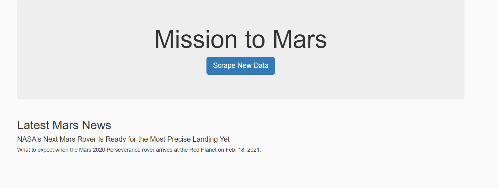
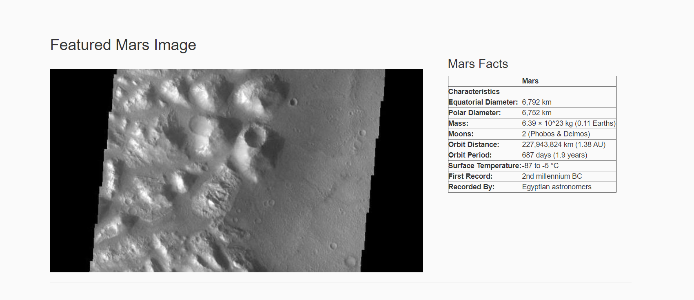
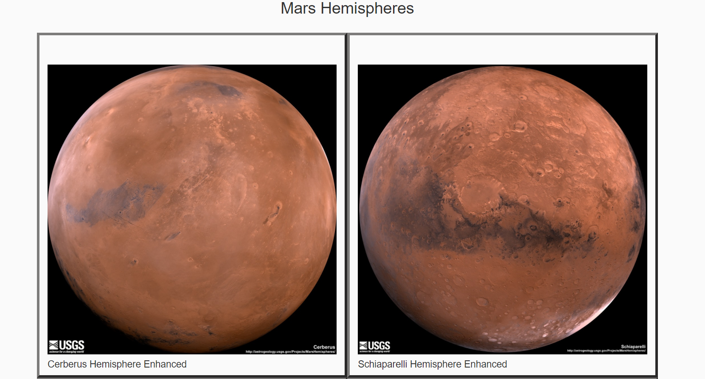

# Web Scraping: Mission to Mars

In this assignment, you will build a web application that scrapes various websites for data related to the Mission to Mars and displays the information in a single HTML page. The following outlines what you need to do.

## Scraping

Completed my initial scraping using Jupyter Notebook, BeautifulSoup, Pandas, and Requests/Splinter.

* Created a Jupyter Notebook and used this to complete all of my scraping and analysis tasks. Scraped four different websites: NASA Mars News, JPL Mars Space Images, Mars Facts, and Mars Hemisphere. 

## MongoDB and Flask Application

Used MongoDB with Flask templating to create a new HTML page that displays all of the information that was scraped from the URLs. Converted my Jupyter notebook into a Python script called scrape_mars.py with a function called scrape that executed all of the scraping code and returned one Python dictionary containing all of the scraped data. Created a route called /scrape that will imported the scrape_mars.py script and called the scrape function.

* Then, created a root route / that will queried the Mongo database and passed the mars data into an HTML template to display the data.

* Created a template HTML file called index.html that took the mars data dictionary and displayed all of the data in the appropriate HTML elements. 

* All these steps resulted in a webpage that included the images below: 

